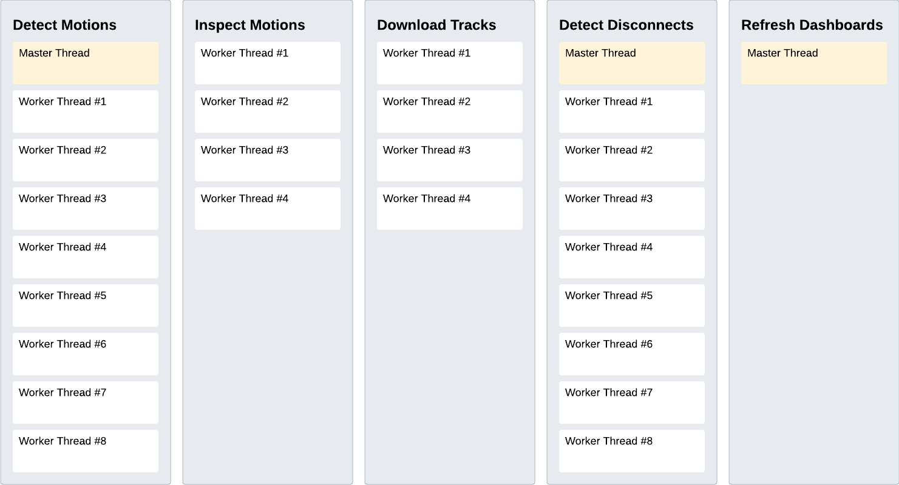

## Motion Server

### Multi-Threading

Multi-threading will ensure that track downloads can be completed as quickly as possible, without being blocked by network searches.

Likewise, network searches (detection of connections + disconnections) will be possible without being blocked by track downloads.

Simple dashboards (essentially HTML files, auto-refreshing every 5 or 10 seconds) will show the status of downloads in real-time.

#### Overview

A number of thread pools will be running within a single server process throughout the day.

The number of threads will be configurable but the example below is expected to be a typical configuration:

Communication between the workers in different thread pools is achieved via message queues. For example, when a motion is detected by a "detect motions" worker thread, the motion details are put onto a message queue for the "inspect motions" thread pool. If an "inspect motions" worker thread determines that track downloads are necessary, relevant details are put onto a message queue for the "download tracks" thread pool.

It can be seen from the diagram above that some of the thread pools do not have master threads. This is because the worker threads will consume directly from the appropriate message queue. The thread pools that detect connections and disconnections of Motions from the network both require a master thread. The role of the master thread is to allocate tasks to the worker threads via an internal message queue, based on the status of motions.

Note: Message queues are a thread-safe way to effectively pass data between different threads, guaranteeing that only one thread will ever consume the message and that all worker threads can be kept as busy as possible.

### Logging

All notable events should be written to a log file; connections, issues with settings, downloads, disconnections, etc.

The log file can either be watched in real-time or analyzed at a later date / time.

### Thread Pools

#### Thread Pool 1 - Detect Motions

Master thread creates a list of motions without any known address information (i.e. new connections or software startup) and puts them on a queue.

The worker threads (typically 8) consume messages from the queue and search for each motion as follows:

- Try to determine the address information using socket.getaddrinfo.
  - If address information is available then try connecting to the IP address on port 80.
    - If the connection attempt fails, discard the address information. This will allow for an auto-retry.
    - If the connection attempt succeeds, close the connection and trigger onwards processing:
      - Set the motion status to "connected".
      - Add the motion to the "connections" queue.
      - Add the motion to the "history" list, removing any earlier entries (if present).
        - The history list will be used to order the motions on the dashboard(s).
        - n.b. The history list will require a mutex to avoid race conditions.
      - Record the connection in the log file.

The master thread will ensure that detection of motions is not attempted more frequently than every 5 or 10 seconds.

#### Thread Pool 2 - Inspect Metadata

A number of worker threads (typically 4) will be reading from the "connections" queue.

For each item retrieved from the queue (corresponding to a single motion), inspect the metadata:

- Retrieve info.json and settings.json from the motion and save in the local cache.
- Retrieve logs.json and save in the local cache.
- Determine if Motion firmware and settings are as expected so that a warning can be shown.
  - Settings will be automatically fixed in the future, when it is supported by the firmware.

- Determine if any tracks need to be downloaded by checking if they are already present locally.
  - If downloads are required then trigger the onwards processing:
    - Set the motion status to "pending".
    - Add the motion to the "downloads" queue.
    - Record the presence of files due for download in the log file.
  - If no downloads are required then there is no further processing:
    - Set the motion status to "completed".
    - Record the absence of files due for download in the log file.
- If any of the above steps encounter an error then do the following:
  - Set the motion status to "failed".
  - Discard the address information. This will invoke an auto-retry, via the motion detection thread.
  - Record the nature of the error in the log file.

Note: There is no need for a sleep timer because the worker threads are waiting on the "connections" queue.

#### Thread Pool 3 - Download Tracks

A number of worker threads (typically 4) will be reading from the "downloads" queue.

For each item retrieved from the queue (corresponding to a single motion), download the tracks:

- A single thread will download all of the required tracks for a single motion:
  - Set the motion status to "downloading" prior to the first download.
  - For each track requiring download:
    - Download the track, giving it the appropriate local filename.
    - Record the download in the log file.
  - Set the motion status to "completed" once all tracks have been downloaded.
- If the download process results in an error then do the following:
  - Set the motion status to "failed".
  - Discard the address information. This will invoke an auto-retry, via the motion detection thread.
  - Record the nature of the error in the log file.

Note: There is no need for a sleep timer because the threads are waiting on the "downloads" queue.

#### Thread Pool 4 - Handle Disconnections

Create a list of motions where the status is "completed".

A number of worker threads (typically 8) will determine when motions in the "completed" list disconnect from the network:

- Try connecting to the IP address on port 80.
  - If the connection attempt succeeds, do nothing because the motion is still on the network.
  - If the connection attempt fails then the motion has almost certainly been disconnected from the network:
    - Set the motion status to "disconnected".
    - Discard the address information. Re-connection will automatically be handled by the motion detection thread.
    - Record the disconnection in the log file.

The master thread will ensure that disconnection checks are not attempted more frequently than every 5 or 10 seconds.

#### Thread 5 - Dashboards

A single thread will be responsible for updating HTML files every 5 or 10 seconds.

The "history list" (maintained by the motion detection thread) will be used to order the motions on the dashboard(s).

n.b. It is almost certain that the motion objects will require a mutex to avoid race conditions with the other 4 threads.

### Technical Notes

#### Startup and Shutdown

It is important to exit threads gracefully when the software is terminated.

Failure to exit threads gracefully may result in partial HTML and / or log files.

Graceful exit of active threads is easy to achieve using a single Python event.
